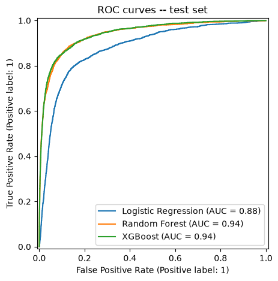

# Telecom Customer Churn Prediction

Predicting which telecom customers are at high risk of churning, using
their usage and billing behavior over three months — so the business can
target retention offers before they leave.

## Problem

Telecom operators lose 15-25% of customers annually, and it costs 5-10x
more to acquire a new customer than to retain one. This project builds and
compares three models to flag high-risk customers early, and identifies
which usage patterns actually drive that risk.

## Results

Metrics below are each model's accuracy/precision/recall/F1 at its own
tuned submission threshold (LR: 0.55, Random Forest: 0.60, XGBoost: 0.80);
ROC-AUC/PR-AUC are threshold-independent. **XGBoost is the best model** by
test ROC-AUC.

| Model | Accuracy | Precision | Recall | F1 | ROC-AUC | PR-AUC |
|---|---|---|---|---|---|---|
| Logistic Regression + PCA | 0.8922 | 0.4779 | 0.6699 | 0.5578 | 0.8793 | 0.4607 |
| Random Forest | 0.9407 | 0.7208 | 0.6782 | 0.6989 | 0.9418 | 0.7548 |
| XGBoost | 0.9428 | 0.7268 | 0.7002 | 0.7133 | 0.9437 | 0.7593 |



Full methodology, including why each modeling choice was made, is in
[`docs/EXPLANATION.md`](docs/EXPLANATION.md).

## Repo structure

```
├── data/                # raw data + how to get it (gitignored CSVs)
├── notebooks/           # the analysis notebook
├── src/churn/           # the actual pipeline: cleaning, features, PCA, models, evaluation
├── scripts/             # build_notebook.py — (re)generates notebooks/telecom_churn_analysis.ipynb
├── outputs/             # figures and submission CSVs the notebook produces
├── docs/EXPLANATION.md  # methodology + business write-up
├── original_work/       # the original submitted notebook and files, untouched, for reference
└── tests/               # unit tests for src/churn
```

## Setup & run

```powershell
python -m venv .venv
.venv\Scripts\Activate.ps1
pip install -r requirements.txt

# get the data (see data/README.md)
New-Item -ItemType Directory -Force data\raw | Out-Null
Copy-Item original_work\train.csv data\raw\train.csv
Copy-Item original_work\test.csv data\raw\test.csv
Copy-Item original_work\data_dictionary.csv data\raw\data_dictionary.csv

python -m pytest                 # run the unit tests
python scripts/build_notebook.py # (re)generate the notebook
jupyter nbconvert --to notebook --execute --inplace notebooks/telecom_churn_analysis.ipynb  # run it end-to-end
jupyter notebook notebooks/telecom_churn_analysis.ipynb  # open it
```

## Key findings

- A month-8 drop in usage and recharge activity is the clearest churn
  signal in this data — much stronger than roaming or long-distance (STD)
  usage, which are real but secondary signals.
- Low-value customers churn at roughly double the rate of medium-value
  customers, and high-value customers churn least of all — retention
  spend is best targeted at the medium-value segment.
- Voice usage predicts retention more than data usage; more competitive
  data packages are a plausible lever the model doesn't directly test.
